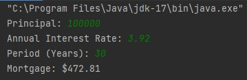

# Java Mortgage Calculator

## Description
A Java program without a graphical user interface that calculates and displays the mortgage monthly payment when given the amount of the mortgage, the interest rate of the mortgage, and the term of the mortgage.

## Screenshots

## Table of Contents
 * [Installation](#installation)
 * [Usage](#usage)
 * [Contributing](#contributing)
 * [Questions](#questions)
        
## Installation

   
## Usage

## Contributing
Charity Rogers

## Questions
If you have any questions, please contact me!

  - GitHub: https://github.com/rogerscl116
  - Email: rogerscl116@gmail.com
  
